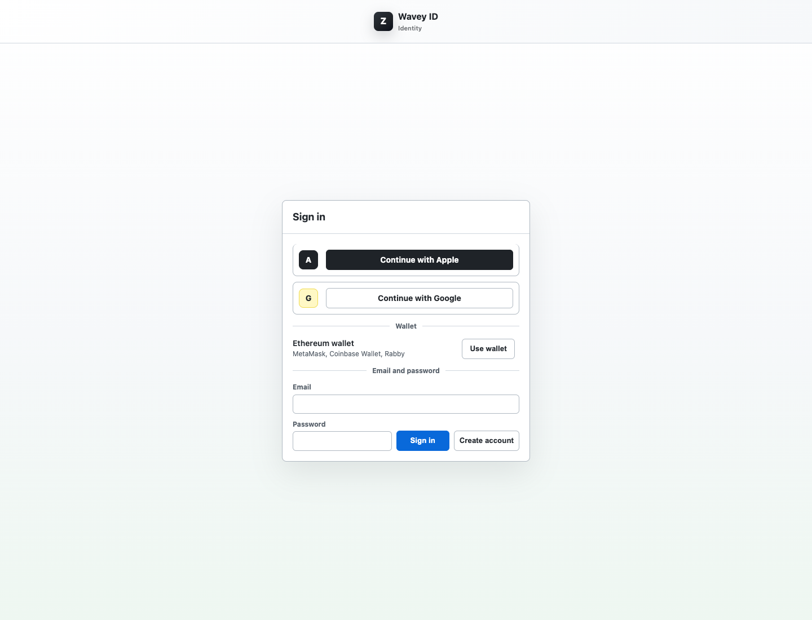
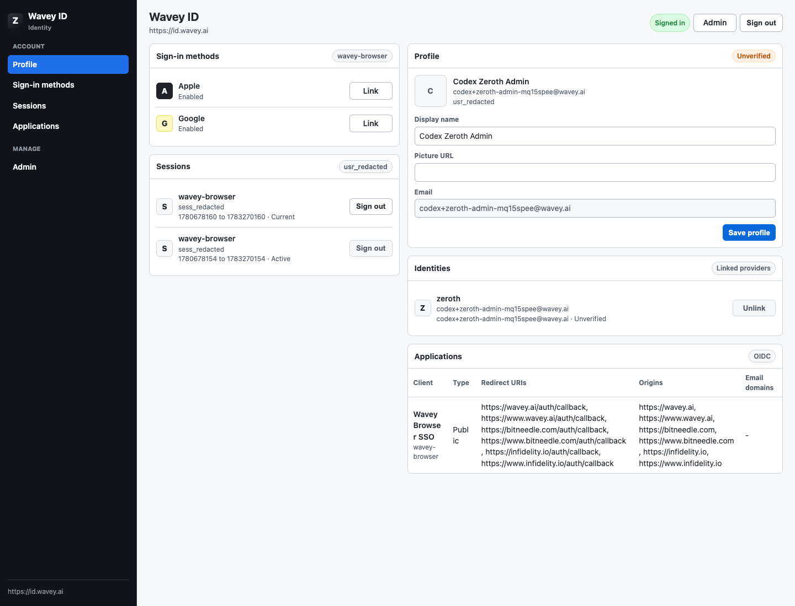
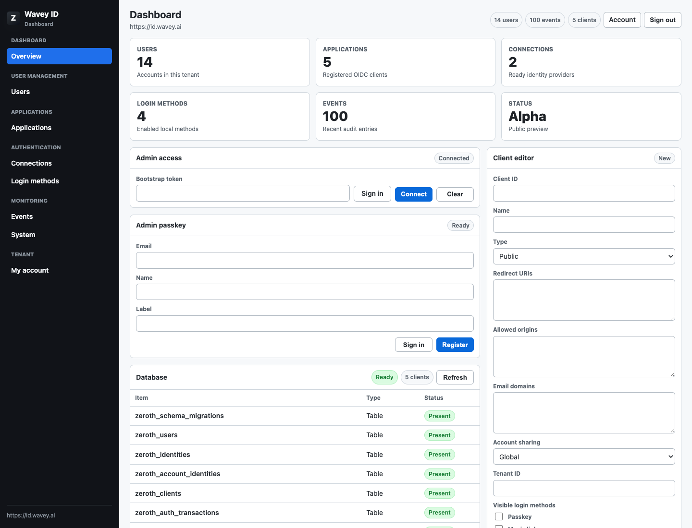
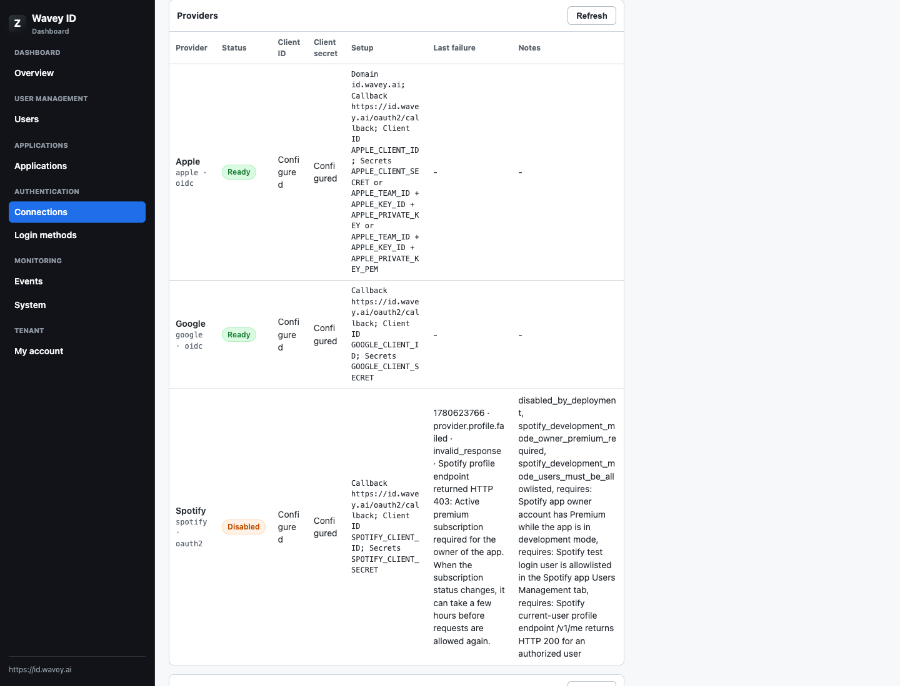
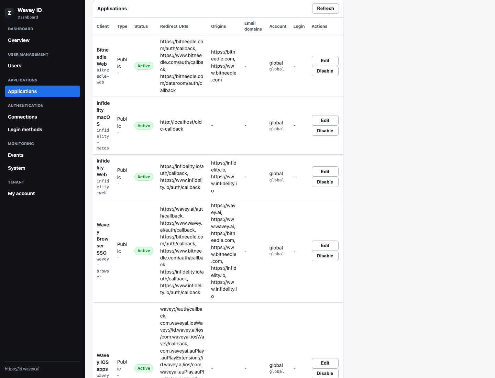

# Zeroth

Zeroth is a minimal first-party identity provider and social login broker.

It is intended to cover the Auth0-shaped role for owned products:

- hosted login
- upstream provider brokering
- OIDC authorization-code flow with PKCE
- Wavey-owned tokens and JWKS
- browser sessions
- native app login for Swift/iOS clients

`wavey-id` should become a deployment of Zeroth. Zeroth should stay generic:
no Wavey domains, provider credentials, branding, or deployment-specific
policy should live in these crates.

## Workspace

```text
zeroth
crates/zeroth-core
crates/zeroth-oidc
crates/zeroth-providers
crates/zeroth-storage
crates/zeroth-server
crates/zeroth-cli
crates/zeroth-ui
crates/zeroth-worker
```

The crates are intentionally thin for now. They define the ownership boundaries
for extracting generic auth code from `wavey-id` and reworking `hyper-idp`
concepts into a persistent, deployable server.

The facade crate keeps the Leptos UI behind the optional `ui` feature so API and
Worker consumers do not pull UI dependencies by default.

`zeroth-worker` follows the existing Rust Cloudflare Worker shape in this repo:
`worker-build` produces `build/worker/shim.mjs`, and D1 is exposed through a
`ZEROTH_DB` binding.

## UI Screenshots

Captured from the live `https://id.wavey.ai` Zeroth deployment on 2026-06-05
using a disposable admin account. Session and user identifiers are redacted in
the captures, and the disposable account was disabled after capture.

| Hosted login | Account management |
| --- | --- |
|  |  |

| Admin overview | Provider and system detail |
| --- | --- |
|  |  |

| Application management |
| --- |
|  |

## Current Status

Implemented so far:

- provider presets for Apple, Google, and Spotify
- OIDC authorization request parsing and registered-client validation
- native loopback redirect validation for Swift clients that use an ephemeral
  localhost callback port
- D1 schema for users, identities, clients, provider auth transactions, auth
  codes, refresh tokens, sessions, signing keys, and audit events
- Worker `/authorize` flow that stores provider transaction state in D1 before
  redirecting upstream, plus `prompt=none` silent SSO from an active Zeroth
  browser session
- Worker hosted Leptos `/login` and `/account` pages; `/login` supports
  browser-session login with client-bounded `return_to`, and `/authorize`
  renders the provider picker when the OIDC request omits `provider`
- Worker hosted Leptos `/admin` and `/admin/clients` page for provider
  readiness, D1 schema status, user list/disable/enable, audit events, and
  registered-client list/create/update operations through the generic management
  APIs, including a first-party Zeroth sign-in action for allowlisted admin
  sessions
- Worker Apple App Site Association endpoint backed by deployment-provided JSON
- Worker `/ready` public launch preflight for HTTPS issuer, parseable signing
  material, and Apple/Google/Spotify provider configuration without D1 reads or
  secret disclosure
- Worker JWKS publishing and token verification for the active ES256 signing
  key plus optional previous public ES256 keys during signing-key rotation
- CLI `signing-key` generator for fresh Zeroth issuer keys and public JWKS
  rotation records
- CLI `schema` exporter for generic D1 migrations and compatibility repair SQL,
  so deployments do not copy `zeroth-storage` schema details by hand
- CLI `validate-secret` checks for Zeroth ES256 private keys, Apple PKCS #8
  private keys, and previous public JWKS rotation JSON without printing secret
  material
- Worker `/clients` management API as the minimal Auth0-management replacement
  for registered-client create/update/list/disable, protected by either a
  deployment admin bearer token or an allowlisted Zeroth browser session, and
  backed by D1
- Worker `POST /__zeroth/db/ensure` schema bootstrap endpoint protected by the
  same admin gate, applying unrecorded generic migrations, persisting migration
  history in D1, and repairing D1 compatibility columns exported by
  `zeroth-storage`
- Worker `GET /__zeroth/db/status` read-only persistence preflight protected by
  the same admin gate, reporting required D1 tables, migrations, compatibility
  columns, and registered-client count without slowing public `/ready`
- Worker `/users` and `/providers/status` management APIs for bounded user
  inspection, reversible user disable/enable with session/refresh-token
  revocation, and provider configuration readiness without exposing secrets
- Worker `/events` management API, D1 audit persistence, and hosted admin
  filters for bounded Auth0-style event inspection without storing token values
  or provider secrets
- Worker `/oauth2/callback` parsing for query callbacks and Apple `form_post`,
  with D1 transaction lookup, browser transaction-cookie binding, conditional
  one-time transaction consumption before provider token exchange, and replay
  rejection
- Zeroth-owned upstream OIDC provider nonces for Apple/Google callbacks,
  separate from downstream app nonces that are preserved only for Zeroth-issued
  ID tokens
- Apple `form_post` callback `user` JSON preservation for first-consent name
  capture, merged with verified Apple ID-token claims before D1 user/identity
  upsert
- Provider-side callback errors such as user cancellation redirect back to the
  stored OIDC, browser-login, or identity-link return URL with error details and
  original app state
- Spotify profile fetch and D1 user/identity upsert using Spotify `account_id`
  as the stable account-linking subject when present, with legacy `id` fallback
- Google/Apple RS256 ID-token verification against provider JWKS and D1
  user/identity upsert from verified OIDC claims
- provider callback completion that either creates a D1-backed browser session
  and returns to the hosted-login `return_to` URL, or issues a hashed Zeroth
  authorization code and redirects back to the registered OIDC client with the
  original app state plus Zeroth's `iss` authorization response parameter
- client-bound authorization error redirects after registered redirect URI
  validation, so relying apps receive `error`, original app state, and `iss`
  instead of JSON for OIDC request failures that are safe to redirect
- Worker `/oauth/token` authorization-code validation for public PKCE clients and
  confidential clients, including registered-client lookup, client-secret
  verification, code lookup, expiry/reuse checks, redirect URI matching, S256
  `code_verifier` validation when the authorization code used PKCE, and
  conditional one-time D1 code consumption before credentials are minted
- Worker `/oauth/token` native provider token exchange for Swift/mobile apps:
  Apple and Google ID tokens are verified against provider JWKS and configured
  native client-ID allowlists, Spotify access tokens are validated through
  Spotify's profile endpoint, Spotify profile `account_id` is used as the
  stable account-linking subject when present, and all three persist the
  provider identity in D1, apply the registered Zeroth client's email-domain
  policy, and return Zeroth-owned access/ID tokens
- registered-client CORS/preflight support for browser calls to token,
  revocation, introspection, userinfo, session, sessions, profile, identities,
  validate, and logout
  endpoints
- ES256 Zeroth-owned access/ID token issuance, standard scoped OIDC ID-token
  claims for `email`/`profile`, conservative `roles` claims (`user`, plus
  `admin` for active Zeroth admin memberships), session-bound `sid` claims,
  refresh-token persistence for `offline_access`, and Worker
  `/.well-known/jwks.json`
- `zeroth-oidc` relying-party helpers for sub-10 ms product gating: match
  multiple exact/prefix protected paths locally, verify the Zeroth access token
  from cached JWKS, and check role/scope claims without calling Zeroth on every
  request
- OIDC discovery metadata for query-mode code responses, rejection of
  unsupported downstream `response_mode` values, the
  `authorization_response_iss_parameter_supported` flag, Zeroth-owned
  issuer/JWKS endpoints for native and browser clients, OAuth Authorization
  Server metadata at `/.well-known/oauth-authorization-server`, explicit
  `prompt` parsing for `none`, `login`, `consent`, and `select_account`, and
  `auth_time` claims for clients that use `max_age`
- refresh-token grant exchange with rotation and fresh Zeroth token issuance;
  auth-code-issued refresh tokens are bound to the browser session that created
  the code, preserve original `auth_time`, require conditional D1 rotation to
  win before a replacement token is issued, and support `prompt=none` silent SSO
  with `max_age` freshness checks
- refresh-token replay detection that revokes the active session-scoped token
  family when a rotated token is presented again by the same client
- Worker `/oauth/revoke` refresh-token revocation for registered clients
- Worker `/oauth/introspect` for RFC7662-style access-token and same-client
  refresh-token introspection by confidential clients, returning inactive
  responses without exposing token values; session-bound access tokens
  introspect as inactive when their D1 session is missing, revoked, expired, or
  mismatched
- Worker `/userinfo` with ES256 bearer access-token verification and D1-backed
  scoped profile response; disabled users or disabled/missing token clients are
  rejected from D1 before profile data is returned, and session-bound access
  tokens require the referenced browser session to still be active
- Worker browser sessions with D1 persistence, secure session cookies,
  optional deployment-controlled parent-domain session cookies for same-site SSO
  across first-party subdomains, `/session`, `/sessions`, `/profile`,
  `/identities`, and `/logout`; session revocation also revokes that session's
  refresh-token family
- Worker OIDC `end_session_endpoint` metadata and bounded post-logout redirects
  through `/logout`
- Worker `PATCH /profile` for bounded local display-name and picture updates
- Worker `/identities/link` for session-bound provider linking through Apple,
  Google, or Spotify, with client-bounded return URLs and callback completion
- Worker `DELETE /identities` for guarded linked-identity unlinking without
  allowing removal of the last login method
- Worker `/validate` for bearer access-token and browser-session validation
  against active D1 users, registered clients, and active D1 sessions when the
  access token carries a `sid`
- Leptos account/login UI for hosted provider choice, profile management,
  linked identities, sessions, and compact OIDC application inventory
- Worker CPU-budget guardrails for the 10 ms Free-plan target: cached ES256
  signing material/JWKS, cached Apple/Google provider JWKS, bounded session and
  identity lists, indexed list queries, bounded request-path cleanup, and
  bounded CORS origin scans
- CLI minting of Sign in with Apple client-secret JWTs from Apple team/key/client
  configuration without mutating Apple Developer records
- Worker runtime minting and isolate caching of Sign in with Apple
  client-secret JWTs from deployment-provided Apple team/key/private-key secrets

Still required before Auth0 can be removed:

- deployment-specific Wavey/Bitneedle Apple Developer identifier setup
- real Apple, Google, and Spotify OAuth client IDs/secrets in the `wavey-id`
  deployment
- a real Cloudflare D1 database ID, schema application, and Wavey client
  seed or `/clients` management upsert
- relying app cutover to Zeroth issuer, client IDs, redirect URIs, and JWKS
- crates.io ownership for the root `zeroth` crate name. As of 2026-06-04,
  crates.io already has `zeroth = 0.0.0` owned by `jason-yau`; the split crate
  names such as `zeroth-core`, `zeroth-oidc`, and `zeroth-worker` are not claimed
  by search, but the root name needs transfer or an owner invite before publish.

## Crates.io

The root crate should remain named `zeroth`, but the name is currently occupied
on crates.io by an unrelated placeholder. Until ownership is transferred, publish
only the split crates.

Publish order matters because crates.io verifies versioned dependencies against
already-published packages:

```sh
cargo publish -p zeroth-core
cargo publish -p zeroth-providers
cargo publish -p zeroth-oidc
cargo publish -p zeroth-storage
cargo publish -p zeroth-server
cargo publish -p zeroth-ui
cargo publish -p zeroth-cli
cargo publish -p zeroth-worker
```

After the root name is transferred:

```sh
cargo publish -p zeroth
```
