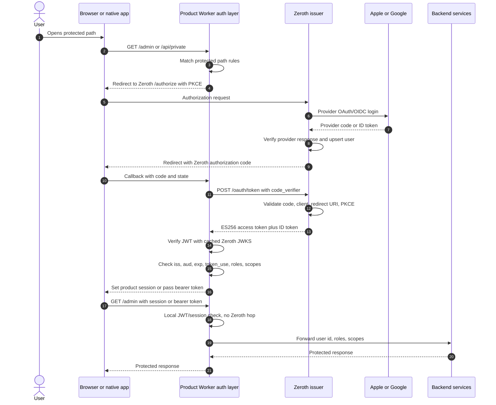
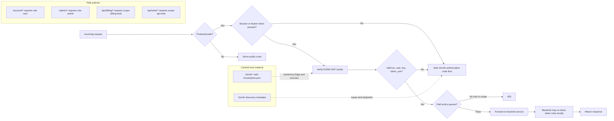
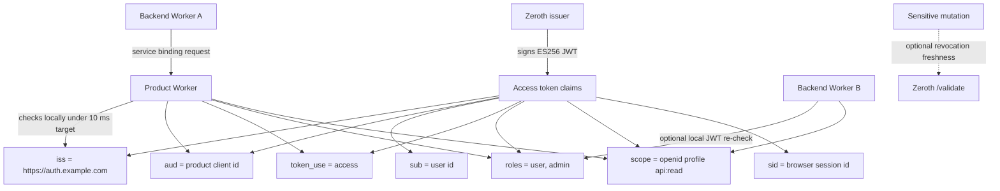

# Zeroth Worker Path Protection

```mermaid
sequenceDiagram
    autonumber
    actor User
    participant App as Browser or native app
    participant Edge as Product Worker auth layer
    participant Zeroth as Zeroth issuer
    participant Provider as Apple or Google
    participant API as Backend services

    User->>App: Opens protected path
    App->>Edge: GET /admin or /api/private
    Edge->>Edge: Match protected path rules
    Edge-->>App: Redirect to Zeroth /authorize with PKCE
    App->>Zeroth: Authorization request
    Zeroth->>Provider: Provider OAuth/OIDC login
    Provider-->>Zeroth: Provider code or ID token
    Zeroth->>Zeroth: Verify provider response and upsert user
    Zeroth-->>App: Redirect with Zeroth authorization code
    App->>Edge: Callback with code and state
    Edge->>Zeroth: POST /oauth/token with code_verifier
    Zeroth->>Zeroth: Validate code, client, redirect URI, PKCE
    Zeroth-->>Edge: ES256 access token plus ID token
    Edge->>Edge: Verify JWT with cached Zeroth JWKS
    Edge->>Edge: Check iss, aud, exp, token_use, roles, scopes
    Edge-->>App: Set product session or pass bearer token
    App->>Edge: GET /admin with session or bearer token
    Edge->>Edge: Local JWT/session check, no Zeroth hop
    Edge->>API: Forward user id, roles, scopes
    API-->>Edge: Protected response
    Edge-->>App: Protected response
```

```mermaid
flowchart LR
    Request[Incoming request] --> Matcher{Protected path?}
    Matcher -- No --> Public[Serve public route]
    Matcher -- Yes --> Token{Session or bearer token present?}
    Token -- No --> Login[Start Zeroth authorization code flow]

    Token -- Yes --> Verify[Verify ES256 JWT locally]
    Verify --> Claims{Valid iss, aud, exp, token_use?}
    Claims -- No --> Login
    Claims -- Yes --> Policy{Path policy passes?}

    Policy -- No role or scope --> Deny[403]
    Policy -- Pass --> Forward[Forward to backend service]
    Forward --> ServiceCheck[Backend may re-check token roles locally]
    ServiceCheck --> Response[Return response]

    subgraph Path policies
        P1["/account/* requires role user"]
        P2["/admin/* requires role admin"]
        P3["/api/billing/* requires scope billing:read"]
        P4["/api/write/* requires scope api:write"]
    end

    subgraph Cached trust material
        JWKS["Zeroth /.well-known/jwks.json"]
        Discovery["Zeroth discovery metadata"]
    end

    JWKS -. cached by Edge and services .-> Verify
    Discovery -. issuer and endpoints .-> Login
```

```mermaid
flowchart TB
    Zeroth[Zeroth issuer] -->|signs ES256 JWT| Token["Access token claims"]
    Token --> Iss["iss = https://auth.example.com"]
    Token --> Aud["aud = product client id"]
    Token --> Sub["sub = user id"]
    Token --> Use["token_use = access"]
    Token --> Roles["roles = user, admin"]
    Token --> Scope["scope = openid profile api:read"]
    Token --> Sid["sid = browser session id"]

    Edge[Product Worker] -->|checks locally under 10 ms target| Iss
    Edge --> Aud
    Edge --> Use
    Edge --> Roles
    Edge --> Scope

    ServiceA[Backend Worker A] -->|service binding request| Edge
    ServiceB[Backend Worker B] -->|optional local JWT re-check| Roles
    ServiceB --> Scope

    Sensitive[Sensitive mutation] -. optional revocation freshness .-> Validate["Zeroth /validate"]
```
